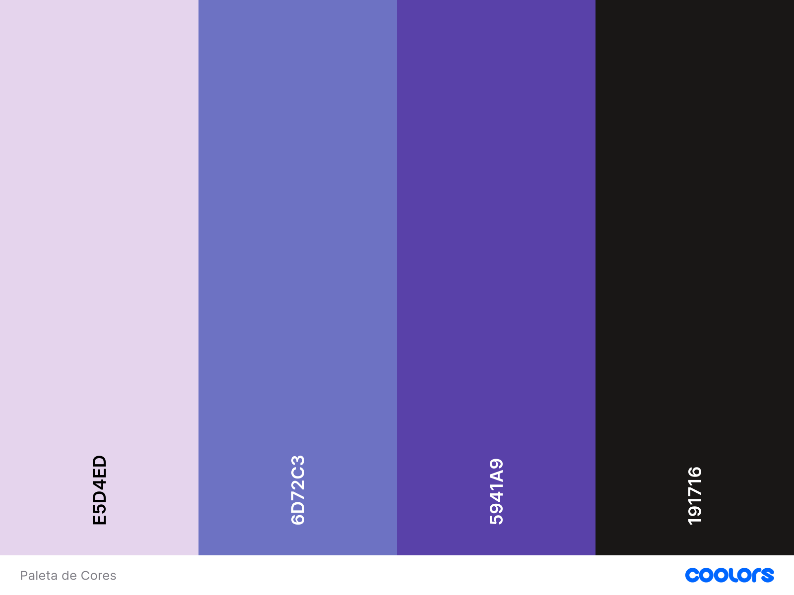

# ⏳ Hiago Belém - Timeline

Este projeto é uma **timeline interativa** criada para praticar HTML e CSS, mostrando minha evolução e aprendizados no desenvolvimento Front-End.  
O site conta com **animações suaves**, uma **paleta de cores harmoniosa** e tipografia limpa.

## 🎯 Objetivo
- Consolidar conhecimentos em **HTML semântico** e **CSS moderno**.  
- Criar uma apresentação visual clara e organizada da minha jornada.

## 🛠️ Tecnologias utilizadas
- **HTML5** → estrutura semântica da página.  
- **CSS3** → estilização, gradientes e animações.

## 🎨 Paleta de cores
A paleta escolhida transmite equilíbrio e harmonia, combinando tons suaves com outros mais profundos, criando uma sensação de sofisticação e modernidade. Ela proporciona leveza visual sem perder contraste, tornando o projeto agradável e convidativo para o visitante.



## 🖋️ Fontes do projeto
O projeto utiliza fontes modernas e legíveis, garantindo clareza e estilo:

**Raleway** – utilizada nos títulos, oferecendo um visual limpo e elegante.  
**Quicksand** – usada nos cards, trazendo leveza e suavidade.  

## 🚀 Como visualizar

Acesse o projeto online através do GitHub Pages:  
👉 [Minha Linha do Tempo](https://hiagobelem.github.io/minha-linha-do-tempo/)

Ou rode localmente:
1. Clone este repositório:
   ```bash
   git clone https://github.com/hiagobelem/minha-linha-do-tempo.git
   
---
👨‍💻 Desenvolvido por Hiago Belém – sempre aprendendo e evoluindo no Front-End.
